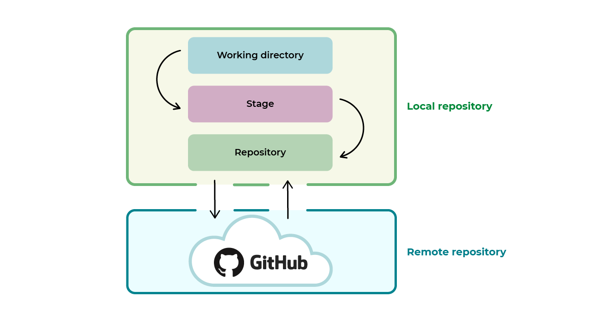

# Tech201-git-github
Tech201-git-github

## Heading 2
### Heading 3
- Let's create our Markdown file
- This line is added on localhost testing

## Git practice steps 
- Created a file on my local workstation using mkdir
- Changed to this folder using 'cd'
- Made a repo in github and copied the https link
- Cloned the repo onto my local workstation using 'git clone'
- Made changes to the README.md file using nano
- Saved the changes on local worksation
- Pushed the changes onto github using 'git push' 

